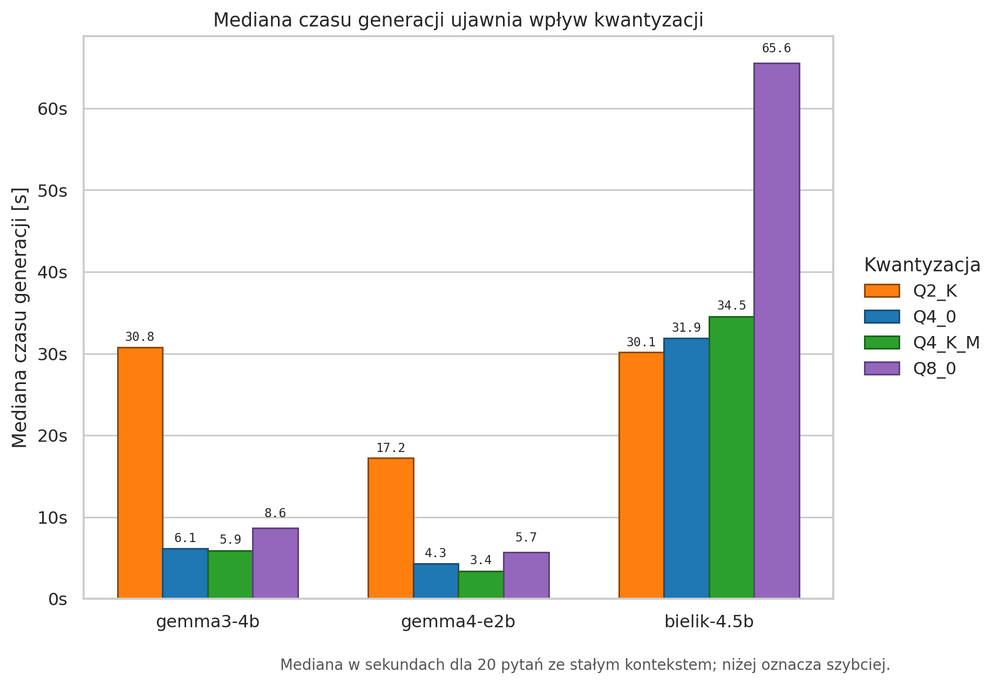
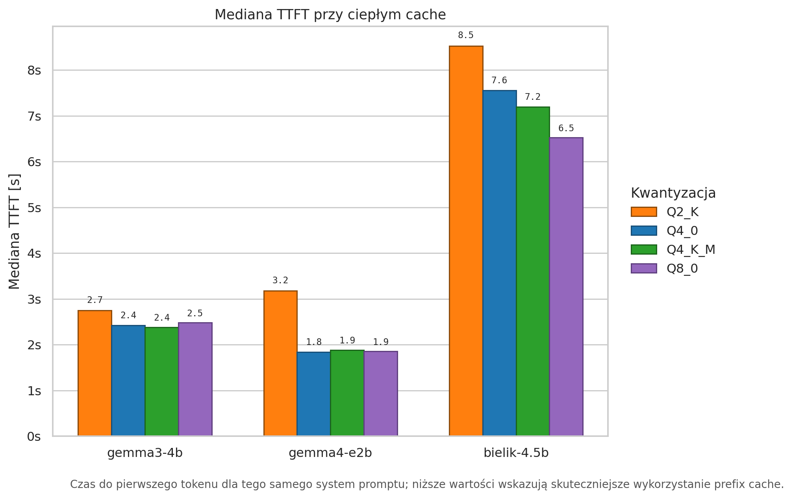
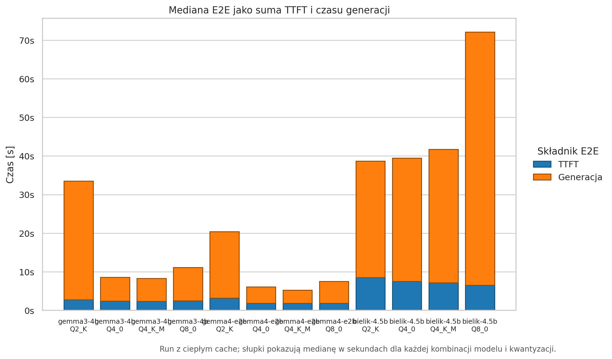
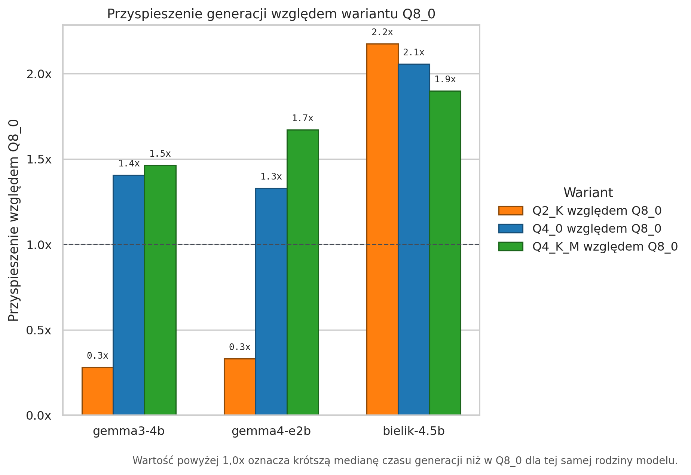
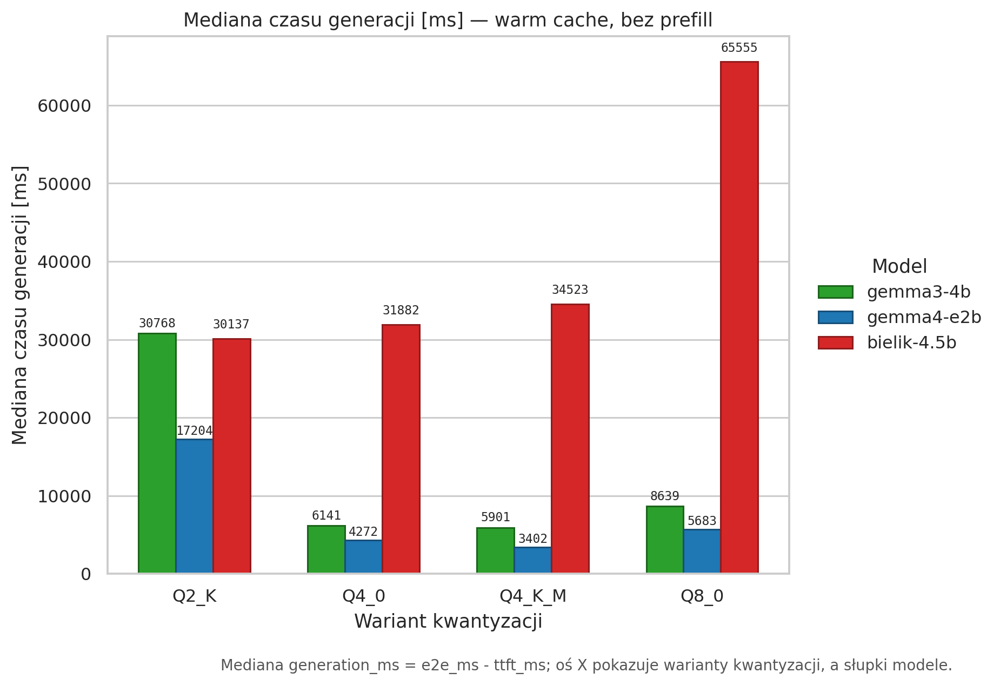
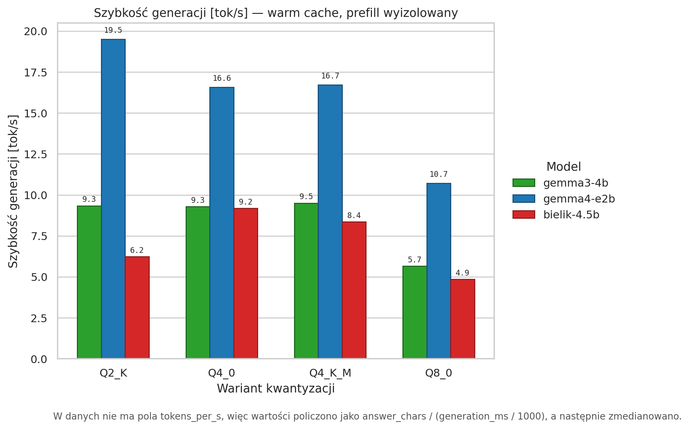
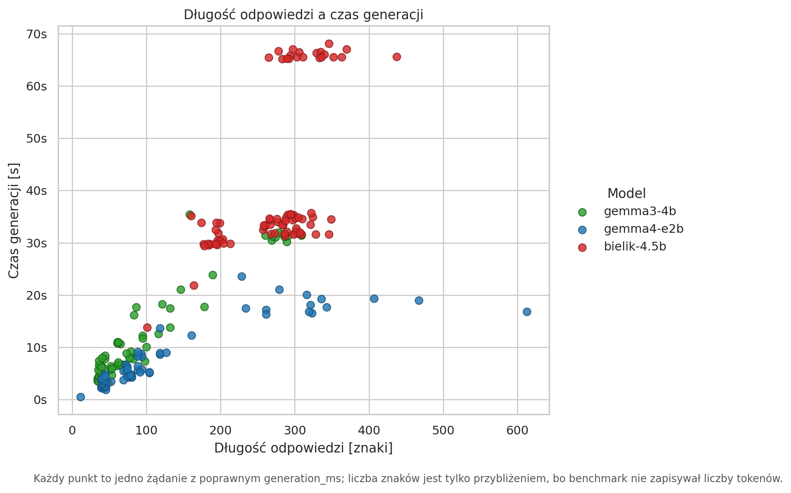
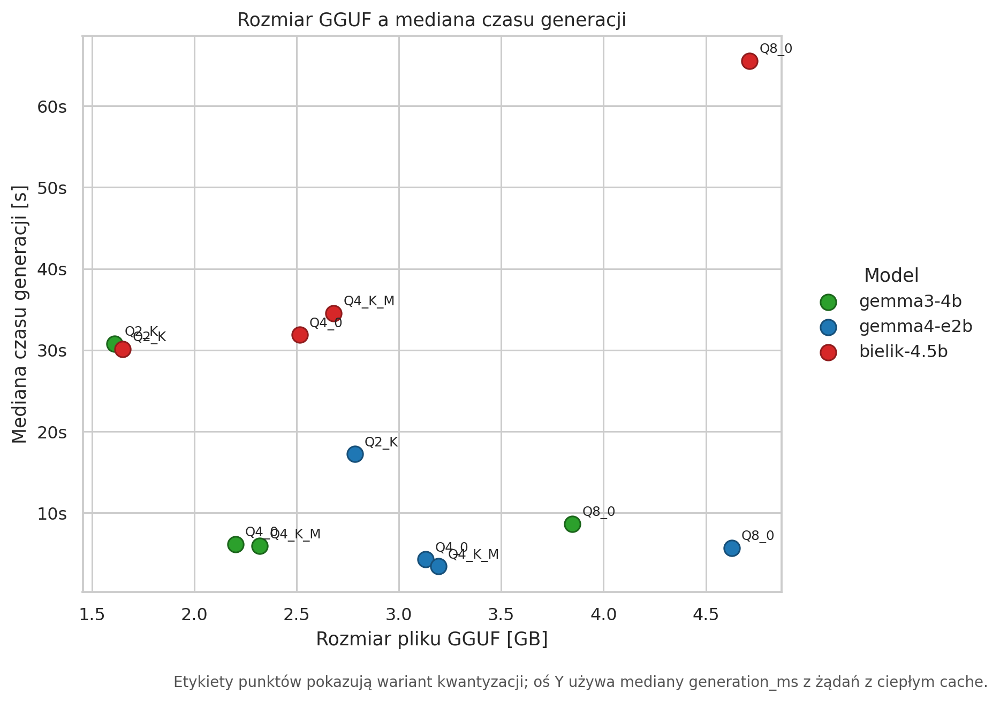

# Ciepły cache ujawnia realny koszt generacji po kwantyzacji

## Podsumowanie

- **Ten przebieg benchmarku mierzy właściwą rzecz dla Raspberry Pi:** rozdziela `TTFT` od `generation_ms = E2E - TTFT`, więc długi prefill nie przykrywa szybkości dekodowania.
- **Dane są kompletne dla siatki testowej:** 240 rekordów, 12 kombinacji model/wariant i 20 pytań dla każdej kombinacji. Globalny odsetek trafień cache wynosi 95%.
- **Warianty Q4 pokazują oczekiwany efekt kwantyzacji dla Gemm.** `gemma3-4b/Q4_K_M` ma medianę generacji 5.90s wobec 8.64s dla `Q8_0`. `gemma4-e2b/Q4_K_M` ma 3.40s wobec 5.68s dla `Q8_0`.
- **Q2 nie jest automatycznie najlepszym wyborem.** W danych widać długie odpowiedzi albo puste odpowiedzi, szczególnie dla `gemma4-e2b/Q2_K`, dlatego interpretacja Q2 wymaga kontroli długości odpowiedzi i jakości.

## Zbiór danych i metodologia

Źródło danych: `analysis/quant-warm-cache/warm_cache_generation_full_20260618_20260621.jsonl`.

Każdy rekord pochodzi z żądania do Ollamy w trybie streaming. `ttft_ms` jest mierzony do pierwszego niepustego tokenu, `e2e_ms` do końca odpowiedzi, a `generation_ms` to różnica między nimi. Test używał stałego promptu systemowego i `keep_alive=30m`, żeby utrzymać model oraz prefix cache w stanie ciepłym.

W raporcie używam median, bo odpowiedzi mają różną długość i w danych są długie ogony. Nie mamy liczby tokenów, więc `answer_chars` i `ms_per_char` są tylko przybliżeniem, a nie pełnym odpowiednikiem liczby tokenów generowanych na sekundę.

## Najlepszy wariant per model

| model       | wariant   | mediana generacji   | mediana TTFT   | przyspieszenie vs Q8   |
|:------------|:----------|:--------------------|:---------------|:-----------------------|
| gemma3-4b   | Q4_K_M    | 5.90s               | 2.38s          | 1.46x                  |
| gemma4-e2b  | Q4_K_M    | 3.40s               | 1.88s          | 1.67x                  |
| bielik-4.5b | Q2_K      | 30.14s              | 8.53s          | 2.18x                  |

**Najważniejszy wykres to mediana generacji, nie E2E.** Po odjęciu TTFT widać, że kwantyzacja wpływa na właściwy koszt dekodowania. Dla Gemm warianty Q4 są wyraźnie lepsze od Q8, natomiast Q2 potrafi produkować dłuższe odpowiedzi i przez to nie zawsze daje najniższy czas końcowy.

## TTFT i ciepły cache

**Ciepły cache stabilizuje TTFT, ale nie kasuje różnic między rodzinami modeli.** Gemmy mają medianę TTFT około kilku sekund, natomiast Bielik pozostaje wyraźnie wyżej. To potwierdza praktyczną konsekwencję dla systemu: jeżeli prompt będzie często zmieniany, benchmark wróci do mierzenia prefilla zamiast szybkości generacji.

**E2E nadal jest sumą dwóch zjawisk.** Ten wykres pokazuje, dlaczego poprzednie pomiary mogły mylić: gdy TTFT/prefill dominuje, różnice między kwantyzacjami są łatwe do przykrycia. Przy ciepłym cache część generacyjna staje się głównym miejscem porównania.

## Przyspieszenie względem Q8

| model       | wariant   | generacja   | przyspieszenie   |
|:------------|:----------|:------------|:-----------------|
| gemma3-4b   | Q4_0      | 6.14s       | 1.41x            |
| gemma3-4b   | Q4_K_M    | 5.90s       | 1.46x            |
| gemma4-e2b  | Q4_0      | 4.27s       | 1.33x            |
| gemma4-e2b  | Q4_K_M    | 3.40s       | 1.67x            |
| bielik-4.5b | Q4_0      | 31.88s      | 2.06x            |
| bielik-4.5b | Q4_K_M    | 34.52s      | 1.90x            |

**Porównanie do Q8 jest najbardziej czytelne dla tezy o kwantyzacji.** Wartość powyżej 1.0x oznacza, że wariant jest szybszy od Q8 w tej samej rodzinie modeli. To jest dokładnie sytuacja, której nie było dobrze widać w runach z zimnym lub zmiennym prefillem.

**Ten wykres pokazuje tę samą metrykę w jednostkach bezwzględnych.** Oś X przechodzi po wariantach kwantyzacji, a słupki porównują modele. Wartość to mediana `generation_ms`, czyli sam czas generacji po odjęciu TTFT/prefilla.

**Szybkość generacji jest liczona per rekord, a potem medianowana.** W danych nie ma pola `tokens_per_s`, dlatego skrypt używa przybliżenia `answer_chars / (generation_ms / 1000)`. Ten wykres należy traktować jako porównanie praktycznej szybkości odpowiedzi, a nie dokładny pomiar tokenizerowych tokenów na sekundę.

## Kontrola długości odpowiedzi

**Część długich czasów generacji wynika z długości odpowiedzi.** To szczególnie ważne dla Q2: krótszy model w pamięci nie pomaga, jeśli wariant zaczyna odpowiadać znacznie bardziej rozwlekle albo zwraca puste odpowiedzi. Dlatego w pracy warto pokazać zarówno medianę `generation_ms`, jak i zastrzeżenie o braku liczby tokenów.

**Rozmiar GGUF zwykle pomaga, ale nie wystarcza jako jedyna metryka.** Mniejsze pliki zmniejszają presję na RAM i często poprawiają generację, lecz zachowanie zależy od rodziny modelu i stabilności odpowiedzi.

## Pełna tabela wyników

| model       | wariant   |   GGUF [GB] | mediana TTFT   | mediana generacji   | mediana E2E   | trafienia cache   |   mediana znaków | przyspieszenie vs Q8   |
|:------------|:----------|------------:|:---------------|:--------------------|:--------------|:------------------|-----------------:|:-----------------------|
| gemma3-4b   | Q2_K      |       1.61  | 2.74s          | 30.77s              | 33.44s        | 100%              |              270 | 0.28x                  |
| gemma3-4b   | Q4_0      |       2.201 | 2.42s          | 6.14s               | 8.46s         | 100%              |               56 | 1.41x                  |
| gemma3-4b   | Q4_K_M    |       2.319 | 2.38s          | 5.90s               | 8.11s         | 100%              |               58 | 1.46x                  |
| gemma3-4b   | Q8_0      |       3.847 | 2.48s          | 8.64s               | 10.83s        | 100%              |               52 | 1.00x                  |
| gemma4-e2b  | Q2_K      |       2.784 | 3.17s          | 17.20s              | 21.56s        | 45%               |                0 | 0.33x                  |
| gemma4-e2b  | Q4_0      |       3.129 | 1.84s          | 4.27s               | 6.26s         | 100%              |               75 | 1.33x                  |
| gemma4-e2b  | Q4_K_M    |       3.192 | 1.88s          | 3.40s               | 5.26s         | 100%              |               50 | 1.67x                  |
| gemma4-e2b  | Q8_0      |       4.626 | 1.86s          | 5.68s               | 7.30s         | 100%              |               70 | 1.00x                  |
| bielik-4.5b | Q2_K      |       1.65  | 8.53s          | 30.14s              | 38.93s        | 100%              |              194 | 2.18x                  |
| bielik-4.5b | Q4_0      |       2.515 | 7.55s          | 31.88s              | 39.44s        | 100%              |              294 | 2.06x                  |
| bielik-4.5b | Q4_K_M    |       2.681 | 7.20s          | 34.52s              | 41.68s        | 100%              |              288 | 1.90x                  |
| bielik-4.5b | Q8_0      |       4.714 | 6.52s          | 65.55s              | 72.48s        | 100%              |              320 | 1.00x                  |

## Jakość danych i anomalie

| model       | wariant   |   rekordy |   poprawne generacje |   brak TTFT |   brak generation_ms |   puste odpowiedzi | trafienia cache   |
|:------------|:----------|----------:|---------------------:|------------:|---------------------:|-------------------:|:------------------|
| gemma3-4b   | Q2_K      |        20 |                   20 |           0 |                    0 |                  0 | 100%              |
| gemma3-4b   | Q4_0      |        20 |                   20 |           0 |                    0 |                  0 | 100%              |
| gemma3-4b   | Q4_K_M    |        20 |                   20 |           0 |                    0 |                  0 | 100%              |
| gemma3-4b   | Q8_0      |        20 |                   20 |           0 |                    0 |                  0 | 100%              |
| gemma4-e2b  | Q2_K      |        20 |                    9 |          11 |                   11 |                 11 | 45%               |
| gemma4-e2b  | Q4_0      |        20 |                   20 |           0 |                    0 |                  0 | 100%              |
| gemma4-e2b  | Q4_K_M    |        20 |                   20 |           0 |                    0 |                  0 | 100%              |
| gemma4-e2b  | Q8_0      |        20 |                   20 |           0 |                    0 |                  0 | 100%              |
| bielik-4.5b | Q2_K      |        20 |                   20 |           0 |                    0 |                  0 | 100%              |
| bielik-4.5b | Q4_0      |        20 |                   20 |           0 |                    0 |                  0 | 100%              |
| bielik-4.5b | Q4_K_M    |        20 |                   20 |           0 |                    0 |                  0 | 100%              |
| bielik-4.5b | Q8_0      |        20 |                   20 |           0 |                    0 |                  0 | 100%              |

W całym pliku jest 11 rekordów bez `generation_ms`. Wszystkie takie rekordy należy traktować jako sygnał niestabilności wariantu, a nie jako szybkie odpowiedzi. Najważniejszy przypadek to `gemma4-e2b/Q2_K`, gdzie puste odpowiedzi zaniżają możliwość bezpośredniego porównania.

## Wniosek do pracy

Wyniki wspierają tezę, że na Raspberry Pi interpretacja benchmarków LLM musi rozdzielać koszt prefilla od kosztu generacji. Jeżeli prompt lub kontekst zmienia się między żądaniami, TTFT może zdominować E2E i ukryć wpływ kwantyzacji. Po utrzymaniu stałego promptu i ciepłego cache różnice w `generation_ms` stają się widoczne: warianty Q4 dla modeli Gemma są istotnie szybsze od Q8, a wybór wariantu powinien uwzględniać zarówno szybkość generacji, jak i stabilność oraz długość odpowiedzi.

## Artefakty

- `tables/podsumowanie_model_wariant.csv`
- `tables/przyspieszenie_wzgledem_q8.csv`
- `tables/jakosc_danych.csv`
- `tables/podsumowanie_pytan.csv`
- `figures/01_mediana_generacji_wedlug_wariantu.*`
- `figures/02_mediana_ttft_wedlug_wariantu.*`
- `figures/03_dekompozycja_e2e.*`
- `figures/04_przyspieszenie_wzgledem_q8.*`
- `figures/07_mediana_generacji_ms_wedlug_wariantu.*`
- `figures/08_szybkosc_generacji_tok_s_wedlug_wariantu.*`
- `figures/05_generacja_a_dlugosc_odpowiedzi.*`
- `figures/06_rozmiar_gguf_a_generacja.*`
